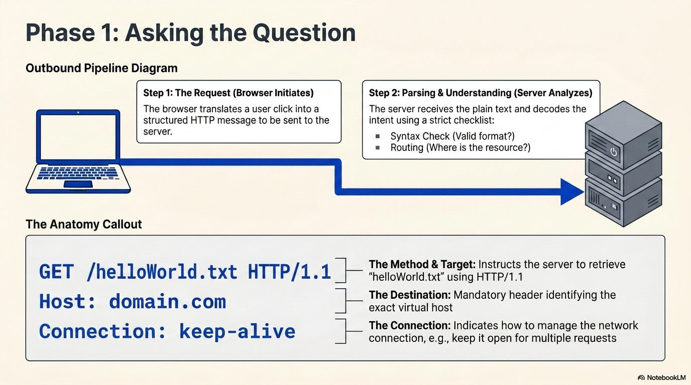
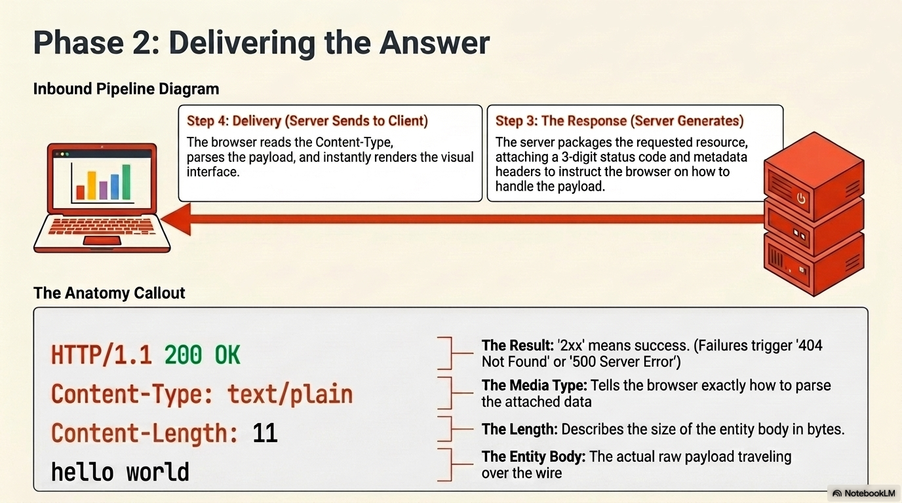

> _This project has been created as part of the 42 curriculum by achamdao, yadib, mjaouchi ._

# Webserv 1337 Project

> This is when you finally understand why URLs start with HTTP

## Description

### 🌐 What is WebServ

> WebServ is an HTTP web server designed to deliver web content (such as Text, stylesheet, images ...) directly to the client (such as a web-browser), it primary goal is to ensure the client receives the exact content and pages he requested, by following the HTTP rules .

### How It Works

 

### 🎯 Project Goals

> Master the HTTP/1.1 Protocol: understanding of how web communication works.

> Improve Technical Skills: designing algorithms, and debugging, and Code Optimization.

> Build Teamwork Experience: Learn how to collaborate with others, use version control (like Git), and design software together.

> New Concepts You Will Learn: Network Sockets, The HTTP Protocol, CGI (Common Gateway Interface), and Nginx Basics .

## 🚀 Getting Started

> Follow these steps to clone, build, and run the WebServ project on your local machine.

### Prerequisites

> Before running the program, ensure you have a C++ compiler (clang++) and make installed on your system, and you must use linux OS.

### 1. Clone the Repository

First, clone the repository and navigate into the project directory:

```bash
git clone git@github.com:YadibDev/The-Fastest-Http-Server.git webserv
cd webserv
```

### 2. Compile the Server

Build the executable using the provided Makefile:

```bash
make
```

This will compile the source files and generate the webserv binary.

### 3. Run the Program

To start the server, execute the binary and provide a configuration file as an argument: \
you can provided two optional arguments to the program, the first one is the configfile and the second
is the Max-Clients that the server can reach .

```bash
./webserv [config file path optional] [max clients number optional]
```

> If no configuration file is provided, the server will fall back to a default configuration.

### 4. Test It in Your Browser

Once the server is running, open your web browser and navigate to the right ip and port number like :

```sh
http://localhost:8080
```

> Note: Replace the ip address and port number with the actual interface:port specified in your configuration file .

```bash
server {
  listen 127.0.0.1:8080;
  ...
}
```

## 🚀 Ressources and how AI used

### 🤖 Use of AI & Research Method

For this project, we used AI as a learning assistant to help us break down complex topics and resources. However, we balanced this with manual research to ensure we built strong, independent problem-solving skills.

How We Used AI:
Explaining Complex Concepts: We used AI to break down low-level systems logic, such as how epoll works behind the scenes.

Simplifying Technical Terms: It helped us understand difficult technical words and complex English vocabulary.

Decoding Documentation: We used it as a helper to navigate and understand  documents like the RFC (Request for Comments) standards.

Writing the README: We used it as an editor to help organize our thoughts, correct our grammar, and polish this README file to make it clear and professional.

### Ressources :

HTTP RESSOURCES : \
https://youtu.be/wW2A5SZ3GkI?si=M8wnSkrGNyc8SBNA \
https://www.youtube.com/watch?v=pi4gaFDBtMc \
https://www.rfc-editor.org/rfc/rfc2616 \
https://developer.mozilla.org/en-US/docs/Web/HTTP \
https://http.dev/ \
stack overflow for finding some problems \

CGI RESSOURCES \
https://www.rfc-editor.org/rfc/rfc3875 \
https://www6.uniovi.es/~antonio/ncsa_httpd/cgi/env.html

Configue File RESSOURCES nginx docs: \
https://nginx.org/en/docs/http/ngx_http_core_module.html#http
https://nginx.org/en/docs/http/ngx_http_core_module.html#location
https://nginx.org/en/docs/http/ngx_http_core_module.html#listen
https://nginx.org/en/docs/http/ngx_http_rewrite_module.html
https://nginx.org/en/docs/http/ngx_http_core_module.html#error_page
https://nginx.org/en/docs/http/ngx_http_index_module.html
https://nginx.org/en/docs/http/ngx_http_core_module.html#client_max_body_size
https://nginx.org/en/docs/http/ngx_http_core_module.html#alias
https://nginx.org/en/docs/http/ngx_http_core_module.html#root

sockets:
https://www.geeksforgeeks.org/computer-networks/socket-in-computer-network/

epoll:
https://medium.com/@m-ibrahim.research/mastering-epoll-the-engine-behind-high-performance-linux-networking-85a15e6bde90